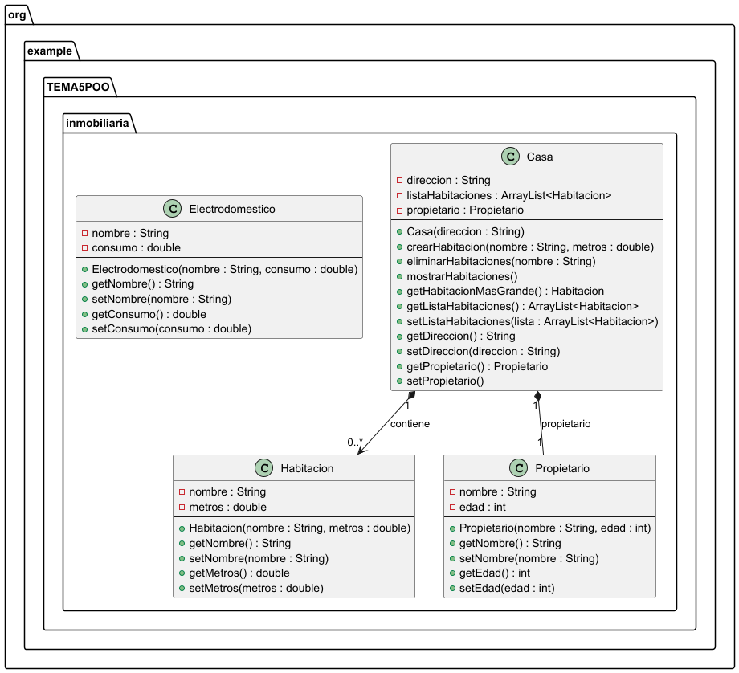

# Práctica 1. Práctica "El Formiguero" y "La Rebelión"

## ÍNDICE
1. [Intro](#1-intro)
2. [Estructura de clases](#2-estructura-de-clases)
   - Diagrama de clases UML
   - Código de PlantUML
   - Contenido de las clases (.java)
4. [Programa principal ("El Formiguero" y "La Rebelión")](#3-programa-principal-el-formiguero-y-la-rebeli%C3%B3n)
5. [Pruebas](#4-pruebas)
6. [Entrega](#5-entrega)

### 1. Intro
> La práctica consiste en una app ...

### 2. Estructura de clases

#### Diagrama de clases UML


#### Código de PlantUML

````
@startuml
package "org.example.TEMA5POO.inmobiliaria" {

class Casa {
    -direccion : String
    -listaHabitaciones : ArrayList<Habitacion>
    -propietario : Propietario
    --
    +Casa(direccion : String)
    +crearHabitacion(nombre : String, metros : double)
    +eliminarHabitaciones(nombre : String)
    +mostrarHabitaciones()
    +getHabitacionMasGrande() : Habitacion
    +getListaHabitaciones() : ArrayList<Habitacion>
    +setListaHabitaciones(lista : ArrayList<Habitacion>)
    +getDireccion() : String
    +setDireccion(direccion : String)
    +getPropietario() : Propietario
    +setPropietario()
}

class Habitacion {
    -nombre : String
    -metros : double
    --
    +Habitacion(nombre : String, metros : double)
    +getNombre() : String
    +setNombre(nombre : String)
    +getMetros() : double
    +setMetros(metros : double)
}

class Propietario {
    -nombre : String
    -edad : int
    --
    +Propietario(nombre : String, edad : int)
    +getNombre() : String
    +setNombre(nombre : String)
    +getEdad() : int
    +setEdad(edad : int)
}

class Electrodomestico {
    -nombre : String
    -consumo : double
    --
    +Electrodomestico(nombre : String, consumo : double)
    +getNombre() : String
    +setNombre(nombre : String)
    +getConsumo() : double
    +setConsumo(consumo : double)
}

Casa "1" *--> "0..*" Habitacion : contiene
Casa "1" *-- "1" Propietario : propietario
}

@enduml

````

### 3. Programa principal ("El Formiguero" y "La Rebelión")

### 4. Pruebas

### 5. Entrega
